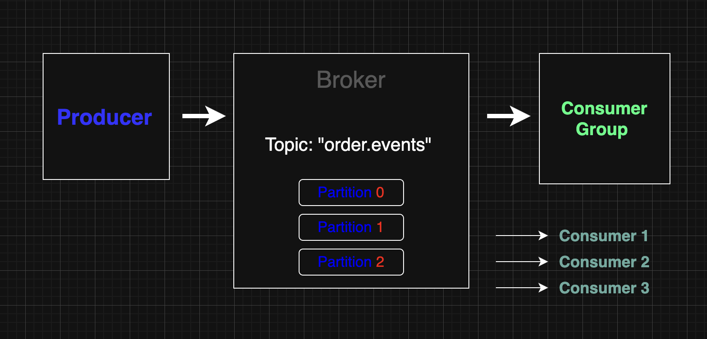

<!--
  이커머스 시스템 설계 
-->
# 제목 이커머스 시스템
<!--
  (Optional: 참고 자료가 없는 작업 - 단순 버그 픽스 등 의 경우엔 해당 란을 제거해주세요 !)
  작업에 대한 참고자료(PR, 피그마, 슬랙 등)가 있는 경우 링크를 참고 자료에 같이 추가해주세요.
  히스토리나 정책, 특정 기술 등에 대한 이해가 필요한 작업일 때 참고자료가 있다면 리뷰어에게 큰 도움이 됩니다!
-->
-----------------------------------------------------------------
## PR
### 9주차

## ☔︎ 현재 커밋 링크 
* 1) Kafka 개념 정리(현재 md 파일에 간략하게 작성)  [2e11e95](https://github.com/JuSuIn/hhplusweek2/commit/2e11e959d67e62ead5c94e88816ffa3dd9e2d55c),[2f95ddc](https://github.com/JuSuIn/hhplusweek2/commit/2f95ddca7ee492b81e74725739050314dc7d9d21#diff-feea40ba4a8e7519ece2194ff14c6c0e991526fc7f56877c98d94deb8b1439baR26)
* 2) Kafka 관련 시나리오 작성(현재 md 파일에 간략하게 작성) : [1566fe5](https://github.com/JuSuIn/hhplusweek2/commit/1566fe54d0b28f44d566c6cc7db3bb401cf45837)
* 3) Kafka 관련 데이터 플로우 : [4c2065d](https://github.com/JuSuIn/hhplusweek2/commit/4c2065d9799174ed0aebf2c6c7db44762b9ce684)

  

-----------------------------------------------------------------

---------------------------------------------------------
## 현재 완료 된 부분

# 1) Kafka 개념 정리
## ✅📝 Kafka 개념 정리 보고서

### 📌 1. Kafka란?
* Kafka는 LinkedIn에서 개발한 분산형 스트리밍 플랫폼으로, 실시간 데이터 파이프라인 및 스트리밍 애플리케이션을 구축할 수 있도록 설계된 메시지 큐 시스템이다.
  * 고성능 분산 로그 시스템
  * 대용량 이벤트 처리
  * 실시간 스트리밍 데이터 처리

### 🧱 2. Kafka 구성 요소
| 구성 요소         | 설명                                            |
| ------------- | --------------------------------------------- |
| **Producer**  | 메시지를 Kafka로 전송하는 역할 (이벤트 발생 측)                |
| **Consumer**  | Kafka로부터 메시지를 구독하여 처리하는 역할                    |
| **Topic**     | 메시지가 전송되는 이름 기반의 채널 (예: `order.completed`)    |
| **Broker**    | Kafka 서버. 메시지를 저장하고 전달하는 노드                   |
| **Partition** | Topic을 분할해 병렬 처리를 가능하게 함                      |
| **Zookeeper** | Kafka 클러스터를 관리하는 데 사용되는 서비스 (최근엔 KRaft로 대체 중) |

### 🔄 3. Kafka 메시지 흐름 구조
* [Producer] → (Topic: order.completed) → [Broker] → [Consumer]
  * 하나의 Topic은 여러 개의 ConsumerGroup이 구독할 수 있으며,
  * 하나의 ConsumerGroup은 Topic의 Partition을 나누어 병렬 처리 가능

###  🎯 4. Kafka의 특징
* 높은 처리량: 수백만 건의 메시지를 초당 처리 가능
* 내구성(Durability): 디스크에 메시지를 저장
* 확장성(Scalability): 브로커와 파티션을 수평 확장 가능
* 복구성(Fault-tolerance): 복제(replication)를 통해 노드 장애 대응

###  🧪 5. 🔐 메시지 내구성과 처리 보장
| 전략                | 설명                             |
| ----------------- | ------------------------------ |
| **at-most-once**  | 중복 없이 최대 1회 전송. 실패 시 손실 가능성 있음 |
| **at-least-once** | 최소 1회 전송. 중복 처리 가능성 있음 (보통 사용) |
| **exactly-once**  | 정확히 1회 처리. 복잡하지만 고도화된 처리 보장    |

###  🧪 6. Kafka 사용시 고려사항
* 메시지 순서를 보장해야 할 경우 → 단일 Partition 내에서만 보장됨
* 정확히 한 번 처리 (Exactly-Once) 보장하려면 추가적인 설정 필요
* 메시지 유실 방지 → acks=all, replication.factor ≥ 2 권장

###  📦 7. Kafka vs RabbitMQ 상세 비교
| 항목                  | **Apache Kafka**                                          | **RabbitMQ**                                    |
| ------------------- | --------------------------------------------------------- | ----------------------------------------------- |
| **기반 아키텍처**         | 분산 로그 저장 기반 (Publish-Subscribe 모델)                        | 메시지 브로커 기반 (큐 모델 - Producer → Queue → Consumer) |
| **메시지 저장**          | 디스크에 영구 저장 (Retention 기반)                                 | 기본적으로 큐에서 소비되면 삭제됨                              |
| **처리 성능**           | 매우 높음 (수십만\~수백만 메시지/초)                                    | 중간 수준 (수천\~수만 메시지/초)                            |
| **메시지 순서 보장**       | 동일 파티션 내에서만 순서 보장                                         | 메시지 큐 자체에서 순서 보장                                |
| **사용 사례**           | 이벤트 스트리밍, 로그 수집, 실시간 분석, MSA 이벤트 브로커                      | 태스크 분배, 알림 시스템, 요청-응답 기반 작업                     |
| **복제/내구성**          | 복제 및 클러스터링 지원 (내구성 높음)                                    | 고가용성 클러스터 구성 가능하나 Kafka보다 복잡                    |
| **확장성**             | 파티션 단위로 수평 확장 가능 (고확장성)                                   | 노드 및 큐 수평 확장 가능 (비교적 제한적)                       |
| **메시지 유실 방지**       | `acks=all`, replication 설정 시 메시지 손실 거의 없음                 | 기본 설정에서는 메시지 유실 가능성 존재 (`durable`, `ack` 설정 필요) |
| **Exactly-once 처리** | 설정과 구현이 복잡하지만 가능 (Kafka Streams 등 활용 시)                   | 트랜잭션 및 ACK 기반으로 구현 가능 (성능 저하 주의)                |
| **지연 처리 지원**        | 별도 구현 필요 (예: Kafka Streams, external storage 등)           | 플러그인 활용으로 지연 큐(Delay Queue) 구현 가능               |
| **모니터링/관리**         | Confluent Control Center, Prometheus + Grafana 등 별도 도구 필요 | 기본 UI 제공 (RabbitMQ Management Plugin)           |
| **Spring 연동**       | `spring-kafka` 라이브러리로 Producer/Consumer 구현                | `spring-amqp`, `spring-rabbit` 등 지원 라이브러리 존재    |
| **학습 곡선**           | 비교적 높음 (분산 시스템 개념 포함됨)                                    | 상대적으로 낮음 (간단한 큐 기반 구조)                          |
| **운영 복잡도**          | 브로커/파티션/Zookeeper 관리 등 복잡함                                | 단순한 설정으로도 운영 가능                                 |
| **보존 기간**           | Retention 기간 지정 가능 (기본 7일, 무제한 설정도 가능)                    | 메시지 소비 후 제거 (Persistent 큐 설정 시 일정 시간 보존 가능)     |
*  Kafka와 RabbitMQ의 주요 특징을 이커머스나 MSA 프로젝트 기준으로 실무에 맞춰 비교한 자료입니다.

### ✅ 8. 마무리
* Kafka는 대규모 실시간 이벤트 처리에 적합한 플랫폼
* Spring Kafka를 통해 Producer/Consumer를 쉽게 구성 가능

---------------------------------------------------------
# 2) Kafka 관련 시나리오 작성
## ✅ Kafka 사용 시나리오 확정 (이커머스 주문 생성 기준)

###  🎯 핵심 목표
* 주문 생성 후 후처리 작업(포인트 적립, 쿠폰 사용, 이메일 발송)을 Kafka 기반의 비동기 이벤트 처리로 구성한다.

### 📌 시나리오 명: 주문 완료 이벤트 발행 (OrderCompletedEvent)
| 구분           | 설명                                                                        |
| ------------ | ------------------------------------------------------------------------- |
| 📍 트리거       | 사용자가 상품을 주문하면 `OrderService.createOrder()`가 실행됨                           |
| 📤 Producer  | `OrderService`에서 `OrderCompletedEvent`를 Kafka 토픽에 발행                      |
| 📬 Consumers | `PointConsumer`, `CouponConsumer`, `EmailConsumer`는 각각 이 이벤트를 수신하고 후처리 수행 |

### 🧩 Kafka 주문 완료 처리 흐름
| 단계 | 구성 요소                           | 설명                                      |
| -- | ------------------------------- | --------------------------------------- |
| ①  | 사용자                             | 프론트엔드에서 주문 요청을 보냄                       |
| ②  | `OrderController.createOrder()` | 주문 요청을 받아 `OrderService` 호출             |
| ③  | `OrderService.createOrder()`    | 주문 생성, DB 저장 후 `OrderCompletedEvent` 발행 |
| ④  | `KafkaProducer.send(...)`       | `order.completed` 토픽에 이벤트 발행            |
| ⑤  | `Kafka Broker`                  | 이벤트를 브로커를 통해 전파                         |
| ⑥  | `PointConsumer`                 | 포인트 적립 수행                               |
| ⑦  | `CouponConsumer`                | 쿠폰 사용 처리 (예: 사용 여부 업데이트)                |
| ⑧  | `EmailConsumer`                 | 이메일 발송 트리거 (주문 확인 이메일 등)                |

### ✅ Kafka 사용 이유
| 이유       | 설명                                 |
| -------- | ---------------------------------- |
| 비동기 처리   | 주문과 후처리를 분리하여 서비스 간 결합도를 낮춤        |
| 확장성      | 소비자를 독립적으로 추가할 수 있어 마이크로서비스 확장에 유리 |
| 장애 격리    | 소비자가 실패해도 주문 처리는 영향을 받지 않음         |
| 분산 환경 대비 | MSA 구조에서 이벤트 드리븐 설계에 필수적           |

### 🎯 확정 시나리오 정리
| 항목     | 내용                                                 |
| ------ | -------------------------------------------------- |
| 이벤트 이름 | `OrderCompletedEvent`                              |
| 발행 위치  | `OrderService.createOrder()` 내부                    |
| 발행 방식  | `KafkaTemplate.send("order.completed", event)`     |
| 소비자들   | `PointConsumer`, `CouponConsumer`, `EmailConsumer` |
| 후처리 작업 | 포인트 적립, 쿠폰 처리, 이메일 발송                              |

---------------------------------------------------------